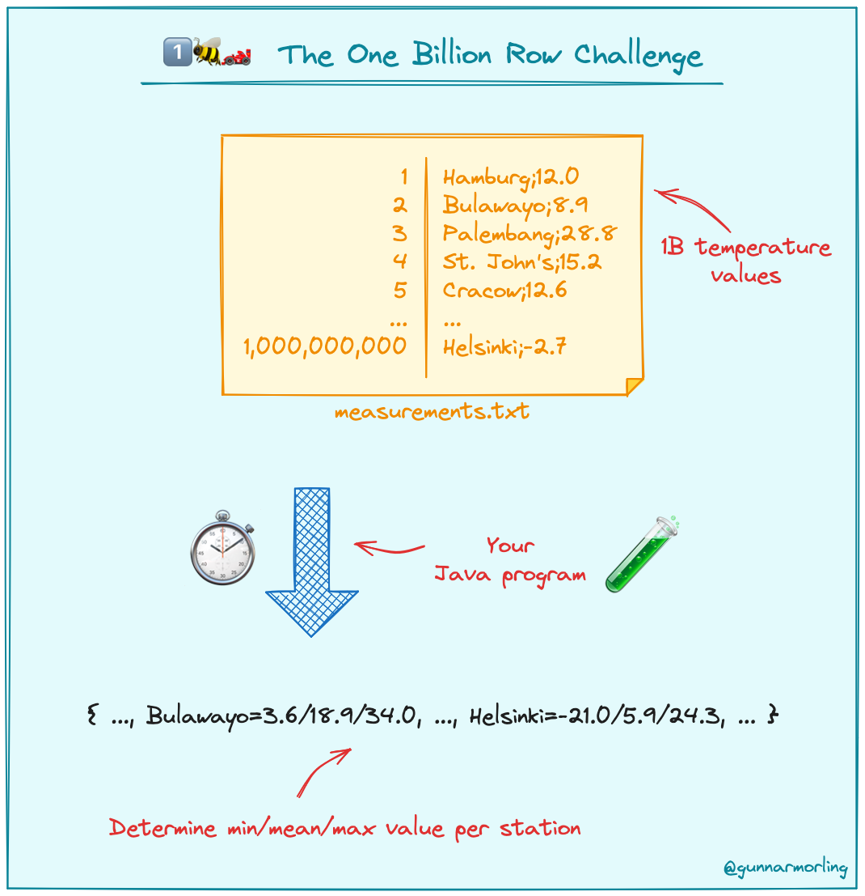

# Go BEC介绍和实际应用


## 边界检查
go在array/slice元素的索引和subslice 操作中，运行时将检查所涉及的索引是否越界--边界检查(Bounds-checking)。如果一个指数超出了范围，就会产生panic ，以防止非法的index造成伤害（如[Heartbleed](https://en.wikipedia.org/wiki/Heartbleed)）。边界检查使我们的代码安全运行，另一方面，它们也使我们的代码运行得慢一些。可以通过生成的[汇编代码](https://go.godbolt.org/z/eqEvh6ech)，查看是否有插入检查` CALL    runtime.panicIndex(SB)`. 这种插入的跳转会影响我们能多大程度上利用cpu的pipelining。

Go语言的BCE技术是基于静态代码分析的SSA。SSA是静态单赋值形式（Static Single Assignment）的缩写，这是一种中间表示（Intermediate Representation，IR）的形式，用于进行编译器优化。这种技术的目标是在编译时期尽可能地消除数组边界检查，以提高代码的运行效率。SSA帮助Go编译器有效地使用BCE(Found IsInBounds elimination)和CSE(common subexpression elimination)等优化。BCE可以避免一些不必要的边界检查，CSE可以避免一些重复计算，使标准Go编译器可以生成更高效的程序。

我们可以使用-gcflags="-d=ssa/check_bce/debug=1"，查看哪些代码插入了【边界检查】，`-d=ssa/check_bce/debug=1`选项会让编译器打印出SSA阶段的详细信息，包括进行边界检查消除（BCE）的决策。


## 常见边界消除方法
总的来说，至于能否进行 BCE 优化，主要取决于我们的代码是否能在编译阶段给编译器足够的信息(hints)来确认哪些访问是安全的。这边介绍几个我认为比较有用的例子：


### 例子1：先索引最大下标
```go
func s2l(s []int) {
	_ = s[0] //  Found IsInBounds
	_ = s[1] //  Found IsInBounds
	_ = s[2] //  Found IsInBounds
}

// BCE
func l2s(s []int) {
	_ = s[2] //  Found IsInBounds
	_ = s[1] //  BCE
	_ = s[0] //  BCE
}

```
显然如果最大下标check通过，那么就不需要往下check了。


### 例子2：如果明确数组长度，请显式写出

```go
func fixLen(a [5]int) { // 当这样写：a []int 下面就不能BCE
	_ = a[4] //  BCE
}
```
### 例子3：使用掩码进行索引

```go
func maskI(src []int, i int) {
	i := i & uint64(len(src) - 1)
	_ = src[i]
}
```


## 实际例子
### 点积函数优化

[sourcegraph](https://sourcegraph.com/blog/slow-to-simd)的工程师在他们的点积计算函数优化[^1]上使用了BCE技术，
这个是BCE之前版本：
```go
func DotUnroll4(a, b []float32) float32 {
	sum := float32(0)
	for i := 0; i < len(a); i += 4 {
		s0 := a[i] * b[i]
		s1 := a[i+1] * b[i+1]
		s2 := a[i+2] * b[i+2]
		s3 := a[i+3] * b[i+3]
		sum += s0 + s1 + s2 + s3
	}
	return sum
}
```

这个是BCE之后版本：
```go
func DotBCE(a, b []float32) float32 {
	if len(a) != len(b) {
		panic("slices must have equal lengths")
	}
 
	if len(a)%4 != 0 {
		panic("slice length must be multiple of 4")
	}
 
	sum := float32(0)
	for i := 0; i < len(a); i += 4 {
		aTmp := a[i : i+4 : i+4]
		bTmp := b[i : i+4 : i+4]
		s0 := aTmp[0] * bTmp[0]
		s1 := aTmp[1] * bTmp[1]
		s2 := aTmp[2] * bTmp[2]
		s3 := aTmp[3] * bTmp[3]
		sum += s0 + s1 + s2 + s3
	}
	return sum
}
```
编译看看：
```
go build -gcflags="-d=ssa/check_bce/debug=1"
# learngo/bce
./dot.go:6:10: Found IsInBounds
./dot.go:6:17: Found IsInBounds
./dot.go:7:10: Found IsInBounds
./dot.go:7:19: Found IsInBounds
./dot.go:8:10: Found IsInBounds
./dot.go:8:19: Found IsInBounds
./dot.go:9:10: Found IsInBounds
./dot.go:9:19: Found IsInBounds
./dot.go:26:12: Found IsSliceInBounds
./dot.go:27:12: Found IsSliceInBounds
```
边界检查从8个下降到了2两个，因为新的slice的len和cap都是4,可以确保aTemp[0]、aTemp[3]、bTemp[0]、bTemp[3]不会越界。
这边比较有趣的是：为什么使用 a[i:i+4:i+4] 而不是 a[i:i+4]?  -- 指定cap可以减少编译器重新计算slice的cap, 从而提高性能

### 业务函数
首先我使用的go版本为1.21, 游戏商品推荐场景中，我们经常需要对新品道具做置顶操作。现在假设我们有个`pkgs []*Pkg` slice, 需要对新品ExtInfo["IsNew"]=="1" 做置顶操作，其中相关删除操作应该已经是最优解了：
```go
type Pkg struct {
	Id      string
	ExtInfo map[string]string
}


func TopNewItemsBce0(pkgs []*Pkg) []*Pkg {
	topPkgs := make([]*Pkg, 0)
	for i := 0; i < len(pkgs); i++ {
		if v, ok := pkgs[i].ExtInfo["IsNew"]; ok && v == "1" { // 方式1,推荐
			topPkgs = append(topPkgs, pkgs[i])
			pkgs = append(pkgs[:i], pkgs[i+1:]...)
			i--
		}
	}
	outPkgs := append(topPkgs, pkgs...)
	return outPkgs
}

func TopNewItemsBce1(pkgs []*Pkg) []*Pkg {
	topPkgs := make([]*Pkg, 0)
	for i := 0; i < len(pkgs); i++ {
		if pkgs[i].ExtInfo["IsNew"] == "1" {  // 方式2，不推荐
			topPkgs = append(topPkgs, pkgs[i])
			pkgs = append(pkgs[:i], pkgs[i+1:]...)
			i--
		}
	}
	outPkgs := append(topPkgs, pkgs...)
	return outPkgs
}
```

其中涉及到条件的判断，写法有下面两种：

- `if v, ok := pkgs[i].ExtInfo["IsNew"]; ok && v == "1" {} ` 
- `if pkgs[i].ExtInfo["IsNew"] == "1" {}`，

这两种写法有啥区别吗？

我们用`
go build -gcflags="-d=ssa/check_bce/debug=1"
` 检测一下


发现TopNewItemsBce1在 `ExtInfo["IsNew"]`处多了一个边界检查，`pkgs[i]` 这边不可避免要做一次BC, 因为在下面有对`i--`，虽然我们知道这个地方没有数组越界的风险，但是go编译器目前并不能进行BCE!


### test 
我们使用generateTestPackages生成1000（游戏商品一般个数很少），每一百个设置一个新品，然后跑一下Benchmark看看
```go
func generateTestPackages() []*Pkg {
	pkgs := make([]*Pkg, 0)
	for i := 0; i < 1000; i++ { // Generate 1000 packages for testing
		pkg := &Pkg{
			Id:      strconv.Itoa(i),
			ExtInfo: make(map[string]string),
		}
		if i%100 == 0 {
			pkg.ExtInfo["IsNew"] = "1"
		} else {
			pkg.ExtInfo["IsNew"] = "0"
		}
		pkgs = append(pkgs, pkg)
	}
	return pkgs
}

func BenchmarkTopNewItemsBce0(b *testing.B) {
	mixPkgs := generateTestPackages() // You need to implement this function to generate test data
	b.ResetTimer()
	for i := 0; i < b.N; i++ {
		TopNewItemsBce0(mixPkgs)
	}
}

func BenchmarkTopNewItemsBce1(b *testing.B) {
	mixPkgs := generateTestPackages() // You need to implement this function to generate test data
	b.ResetTimer()
	for i := 0; i < b.N; i++ {
		TopNewItemsBce1(mixPkgs)
	}
}
```
在我的开发机上测试，二者的性能差的竟然有要一倍！
```txt
goos: linux
goarch: amd64
pkg: learngo/bce
cpu: AMD EPYC 7K62 48-Core Processor
BenchmarkTopNewItemsBce0
BenchmarkTopNewItemsBce0-16                        85531             14188 ns/op            8192 B/op            1 allocs/op
BenchmarkTopNewItemsBce1
BenchmarkTopNewItemsBce1-16                        48134             24912 ns/op            8192 B/op            1 allocs/op
```

所以，对于判断map中每个key取值是不是符合我们的预期，我们最好是使用`v, ok := map[key]; ok && v ==` 这种形式。

## 1brc

github很火的一个[Java “十亿行挑战”（1BRC）"](https://github.com/gunnarmorling/1brc) . 虽然该 任务要求使用java完成挑战，但是很多开发者也用其他语言实现了一下，比如go、c++。我们可以看到[Alexander Yastrebov’s](https://github.com/gunnarmorling/1brc/blob/main/src/main/go/AlexanderYastrebov/calc.go)（之前go版本最快的实现 2.9s）其中也用了BCE进行代码性能优化---给编译器明确不会越界的信息
```go
...
	// keep short and inlinable
	getMeasurement := func(hash uint64, value []byte) *measurement {
		i := hash & uint64(entriesSize-1)
		entry := &entries[i] // 通过上面hash & uint64(entriesSize-1)可知 i < entriesSize 

...
```
[Ben Hoyt](https://benhoyt.com/) 在他的文章[^2]中描述了他从最初的简单未优化版本（耗时1分45秒）到最终的优化并行版本（耗时仅3.4秒）的九个不同解决方案, 其中很多点还是很值得看看的，特别是对于处理大量数据的程序，比如：

1. **使用指针值的map**：通过使用`map[string]*stats`而不是`map[string]stats`，可以减少哈希操作的次数，因为更新map时不需要重复哈希。

2. **手工解析数据**：避免使用标准库中的`strconv.ParseFloat`，而是编写自定义的解析函数来处理简单的数字格式，这样可以减少不必要的错误处理和复杂性。

3. **固定点整数**：对于只有单个小数位的温度数据，使用固定点整数代替浮点数可以提高性能，因为整数运算通常比浮点运算更快。

4. **避免使用`bytes.Cut`**：通过从字符串末尾开始解析温度，而不是使用`bytes.Cut`从开头查找分隔符，可以减少不必要的字符串遍历。

5. **避免`bufio.Scanner`**：通过直接读取文件块并手动处理每一行，可以避免`bufio.Scanner`的额外开销，这样可以更有效地处理数据。

6. **自定义哈希表**：实现一个自定义的哈希表可以提高查找和插入的效率，尤其是当标准库的`map`操作成为性能瓶颈时。

7. **并行处理**：将文件分割成多个块，并使用多个goroutine并行处理每个块，然后合并结果，可以显著提高处理速度，尤其是在多核处理器上。

8. **内存映射文件**：虽然文章中没有使用，但提到了内存映射文件作为一种优化手段，这可以减少磁盘I/O操作，尤其是在处理大型文件时。

9. **代码剖析和性能分析**：使用Go的剖析工具（如`pprof`）来识别代码中的瓶颈，并针对性地进行优化。

10. **简化数据结构**：通过合理设计数据结构，例如使用数组或切片代替map，可以在某些情况下提高性能。


他在最后提了一个问题：

> Why does if items[hashIndex].key == nil show as taking 5.01s, but the call to bytes.Equal shows as only 390ms. Surely a slice lookup is much cheaper than a function call? 


.png "插入了边界检查")

详细看了一下这个`items[hashIndex].key == nil`地方的汇编代码，可以看到这边进行了边界检查

我们通过使用Alexander Yastrebov一样的BCE方法，来看看优化之后的cpu pprof source 性能

.png "BCE之后")

所以Ben Hoyt提的问题的原因应该就是go因为边界检查带来的影响。
这边提一下：当我尝试BCE之后原来Ben Hoyt的r9版本在我Linux机器跑到了3s以内，但是在运行完Alexander Yastrebov’s的mmp版本之后，优化后的和r9版本跑的时间就基本上差不多了，百思不得其解。可惜当时忘了保存3s(印象是2.6s 好像提升的有点离谱)以内的截图。
后面我重新在windows机器（Intel(R) Core(TM) i7-10700 CPU @ 2.90GHz 32G内存）上测试了一下，大概有3%的提升。


## 小结
更多例子可以参考：[^2]和[^4]，可以看出是否能BCE是需要一些实践验证的，并且BCE之后性能并不一定就有提升。

参考：
[^1]:https://sourcegraph.com/blog/slow-to-simd
[^2]:https://benhoyt.com/writings/go-1brc/
[^3]:https://go101.org/article/bounds-check-elimination.html
[^4]:https://go101.org/optimizations/5-bce.html

