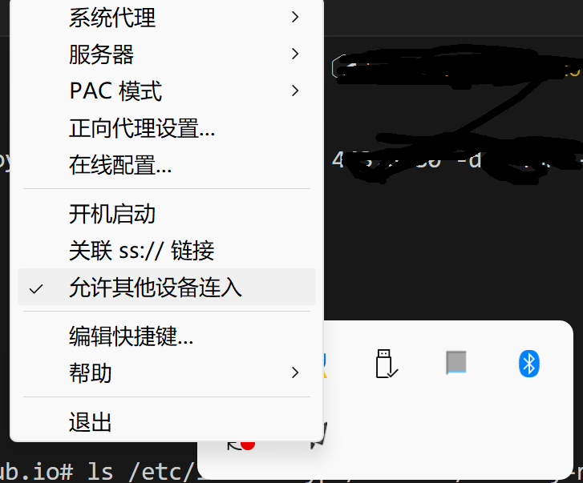
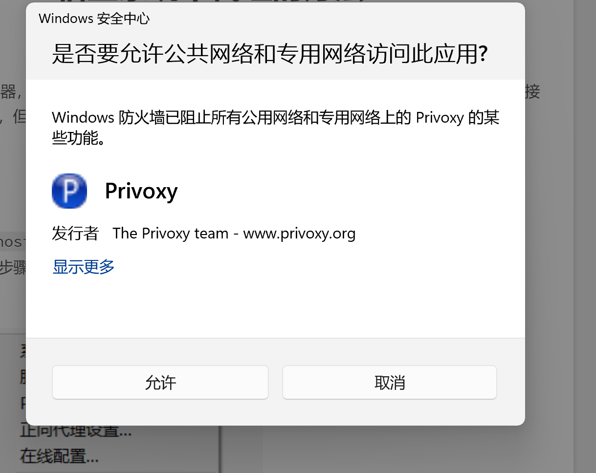
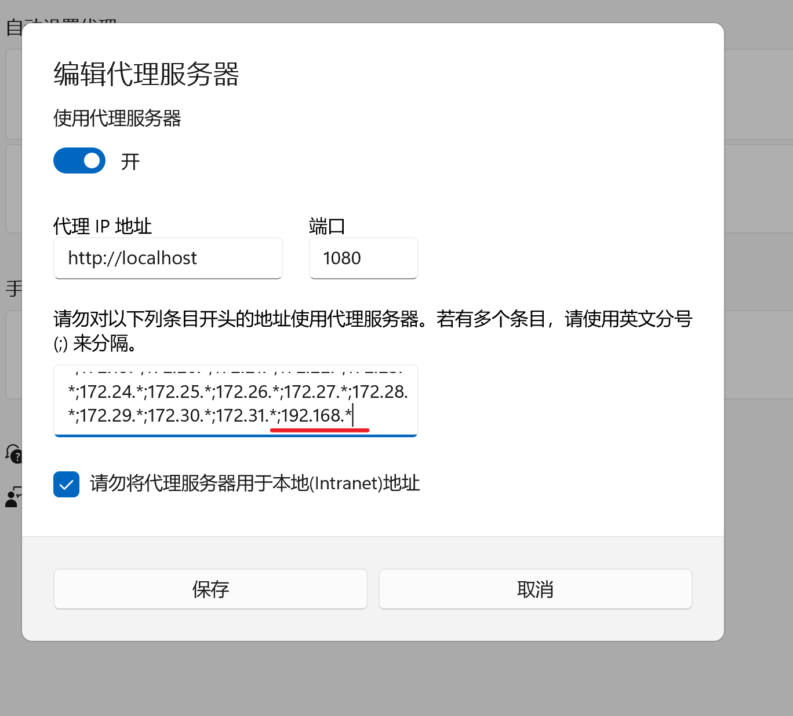
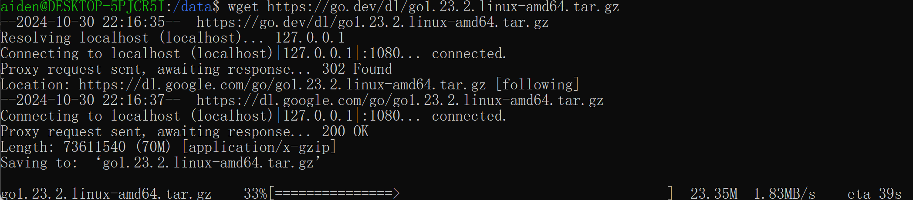

# Wsl配置使用宿主机网络代理&go安装


我刚刚在windows10上安装了Ubuntu-24 wsl，想着安装一下go，于是根据：https://go.dev/doc/install,  使用wget 去获取go安装包：
```
wget https://go.dev/dl/go1.23.2.linux-amd64.tar.gz
```

发现下载卡住了，连接超时失败，原来是走了(https://dl.google.com/go/go1.23.2.linux-amd64.tar.gz) Google的连接，但是我宿主机已经开了代理了，看来是wsl机器上没有用上宿主机的代理，下面我分享一下我解决这个问题的过程。

## 配置 .wslconfig 使用代理

在 C:\Users\<UserName>\.wslconfig 中添加以下内容(如果不存在可以手动创建)：
```
[wsl2]
networkingMode = mirrored  # 启用镜像网络
autoProxy = true #强制 WSL 使用 Windows 的 HTTP 代理信息
```

然后powershell中重启wsl：
```
wsl --shutdown
wsl
```

此步骤参考：https://shirolin.github.io/posts/e41dabd5/index.html

## 允许 Shadowsocks 服务非本地来源地址
如果是使用Shadowsocks作为代理软件，需要开启：允许其他设备接入



## 检查宿主代理设置是否过滤掉wsl的ip

设置->网络和Internet->代理->手动代理->编辑


查看wsl的ip：
```
# powershell
wsl  hostname -I
```
像我的机器查出来是：192.168.43.xx, 刚好在代理的过滤名单内，所以一定要去掉：



***注意***
去掉代理的过滤之后，需要重启一下wsl，果然重启大法好啊


go 安装包现在可以正常下载了


